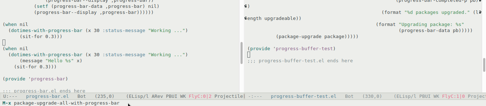

# emacs-progress-bar

A progress bar in Emacs echo area.



## Install

`progress-bar.el` has the progress bar implementation.

Load `progress-bar-integrations.el` for integrating the progress bar in some of Emacs operations, like package management.

## Usage

The preferred method for using a progress-bar is via the utility functions:
`dolist-with-progress-bar`, `dotimes-with-progress-bar` and `mapc-with-progress-bar`.

Example:

```lisp
(dolist-with-progress-bar (x (cl-loop for i from 1 to 10 collect i)
                              :status-message (list "Started ..."
                                                    (lambda (pb)
                                                      (format "Processing %s..." (progress-bar-data pb)))
                                                    "Completed!"))
     (sit-for (seq-random-elt '(0.3 0.4 0.5))))
```


